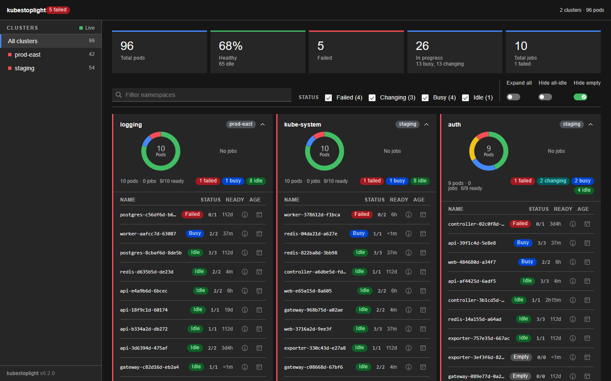

# kubestoplight

A dual-mode Kubernetes pod monitor — run as a terminal TUI or a self-hosted web application.



<sub>Rendered from [mock mode](#try-it-without-a-cluster) and regenerated on every PR that touches `web/`.
More: [failing](docs/screenshots/failing.png) · [large](docs/screenshots/large.png) ·
[empty](docs/screenshots/empty.png) · [describe](docs/screenshots/describe.png) ·
[logs](docs/screenshots/logs.png) · [add cluster](docs/screenshots/add-cluster.png)</sub>

## Modes

| Mode | Command | Description |
|------|---------|-------------|
| **TUI** | `./kubestoplight` | Charmbracelet Bubble Tea terminal UI (original) |
| **Web** | `./kubestoplight --web` | React SPA served by an embedded Go HTTP server |

## Prerequisites

| Tool | Minimum version | Purpose |
|------|----------------|---------|
| Go   | 1.21+          | Build the binary |
| Node | 20+            | Build the React frontend |
| npm  | 9+             | Install frontend dependencies |

## Try it without a cluster

Only Node is needed — the UI runs against a built-in fake backend:

```bash
cd web
npm install
npm run dev:mock      # http://localhost:5173
```

Scenarios (`MOCK_SCENARIO=mixed|healthy|failing|empty|large`) and agent/contributor
guidance are in [AGENTS.md](AGENTS.md).

## Build

```bash
# Install frontend deps, build the SPA, then compile the Go binary
# with the web/dist assets embedded.
make build

# Or step by step:
cd web && npm install && npm run build
go build -o kubestoplight .
```

> **Note:** `go build` requires `web/dist/` to exist. Always run `make web-build`
> (or `cd web && npm run build`) before `go build`.

## Usage — TUI mode

```bash
./kubestoplight                          # uses ~/.kubestoplight/config.yaml
./kubestoplight --config myconfig.yaml
```

## Usage — Web mode

```bash
./kubestoplight --web                           # http://127.0.0.1:8080
./kubestoplight --web --addr 0.0.0.0:9090       # listen on all interfaces
./kubestoplight --web --config /path/to/cfg.yaml
```

Open `http://127.0.0.1:8080` in your browser. The dashboard features:

- **Summary strip** — four stat tiles (total pods, healthy %, failed count, in-progress) with color-coded accent borders
- **Sidebar** — cluster list with per-cluster status dots; click to filter the main view
- **Filter bar** — live search (`/` to focus), status checkboxes with counts, hide-idle and hide-empty toggles
- **Namespace cards** — pod grid (8×8 colored squares), stacked status bar, expand/collapse with pod detail rows
- **Auto-expand** — namespaces with failed pods expand automatically on first load

Pod status cards update live every polling interval (default 3 s).

### First-time setup (no config file)

In **web mode**, if no config file exists kubestoplight creates a blank one at
`~/.kubestoplight/config.yaml` and starts with an empty cluster list.
Use the **Add cluster** button (+ icon in the sidebar) to register your first remote.

## Managing remote clusters via the UI

Click the **+** icon in the sidebar header to open the **Add cluster** modal.

| Auth method | When to use | Required fields |
|-------------|------------|-----------------|
| **Kubeconfig file** | RKE2 generates `/etc/rancher/rke2/rke2.yaml`; copy or mount it on this host | Kubeconfig path (e.g. `~/.kube/rke2-prod.yaml`), optional context name |
| **Bearer token** | Service-account token or long-lived API token from the cluster | Server URL (`https://<ip>:6443`), token, optional TLS skip |

Changes are saved immediately to `config.yaml` and the polling engine connects
(or disconnects) without a server restart.

To **edit** or **remove** a cluster, hover over it in the sidebar — Edit and Remove
buttons appear inline.

## Configuration file

Config is stored at `~/.kubestoplight/config.yaml` (or the path given with `--config`).
The file is shared between TUI and web modes.

```yaml
clusters:
  - name: rke2-prod
    auth: kubeconfig
    kubeconfig:
      path: ~/.kube/rke2-prod.yaml
      context: default
    enabled: true
    namespace: ""         # empty = all namespaces

  - name: rke2-staging
    server: https://192.168.1.200:6443
    auth: bearer
    bearer_token: "{{ env:RKE2_STAGING_TOKEN }}"
    tls:
      insecure_skip_verify: true
    enabled: true

polling_interval: 3s
```

Supports `~` expansion in paths and `{{ env:VAR }}` interpolation for secrets.

### Auth methods

| Value | Description |
|-------|-------------|
| `kubeconfig` | Uses client-go's kubeconfig loader (custom path + context) |
| `bearer`     | Sets a bearer token directly on the REST config |
| `tls`        | Client cert/key + CA file |
| `oidc`       | OIDC tokens |
| `serviceaccount` | In-cluster service account mount |

Only `kubeconfig` and `bearer` are exposed in the web UI; all five work via
direct config file editing.

## Status colours

| Status   | Colour | Meaning |
|----------|--------|---------|
| Idle     | Green  | Running, stable, no restarts |
| Busy     | Blue   | Running but restarting |
| Changing | Amber  | Pending or terminating |
| Failed   | Red    | CrashLoopBackOff, image errors, or terminated with error |
| Empty    | Gray   | No container status data |

## Web UI key bindings

| Key | Action |
|-----|--------|
| `/` | Focus the namespace search filter |

## TUI key bindings

| Key | Action |
|-----|--------|
| `q` / `ctrl+c` | Quit |
| `tab` | Toggle sidebar / card focus |
| `j` / `k` | Navigate rows |
| `pgup` / `pgdn` | Page up/down |
| `home` / `end` | Jump to top/bottom |

## Development — web UI

```bash
cd web && npm install && npm run dev
```

Vite runs on `:5173` with proxy rules that forward `/ws` and `/api` to the Go
backend on `:8080`. Start the backend separately:

```bash
go run . --web
```

## Design

- **Backend:** Go stdlib `net/http` + `nhooyr.io/websocket`; no framework
- **Frontend:** React 19 + TypeScript 6, built with Vite, embedded via `go:embed`
- **UI kit:** [IBM Carbon Design System](https://carbondesignsystem.com/) v11 — `@carbon/react` with Gray 100 (G100) dark theme
- **Live updates:** WebSocket at `/ws/pods` pushes `NamespaceGroup` snapshots every polling interval
- **Single binary:** `go build` produces one self-contained executable
- **Dual mode:** Same binary, same config file — TUI for terminals, web for browsers

## License

[MIT](LICENSE)
